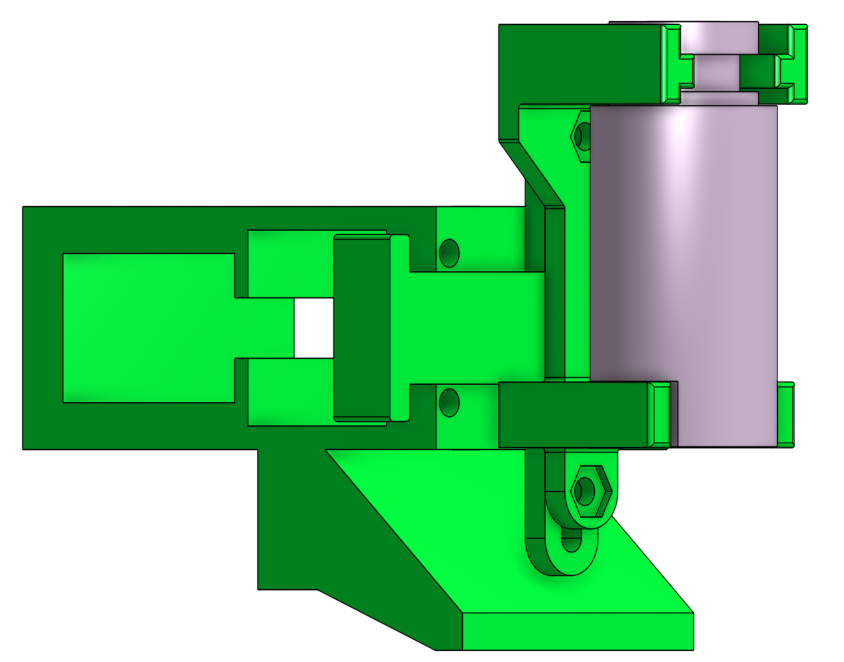

# J-Head adapter

  * [Head holder][STL01]
  * [J-Head holder][STL02]

These two pieces allow to mount a [J-Head hotend][JHE01] on the Foldarap's header (adaptable to other printer headers).

[Foldarap][FOL01] is the _Folding RepRap_ by [Emmanuel Gilloz][EMM01].

The first piece holds the JHead. The second one is the interface with the header and it pushes the _X-endstop_.

JHead holder can be adjusted in height in order to level with the blower.

[EMM01]: http://watsdesign.blogspot.nl/
[FOL01]: http://reprap.org/wiki/FoldaRap
[JHE01]: http://reprap.org/wiki/J_Head_Nozzle
[STL01]: head_holder.stl
[STL02]: jhead_holder.stl
