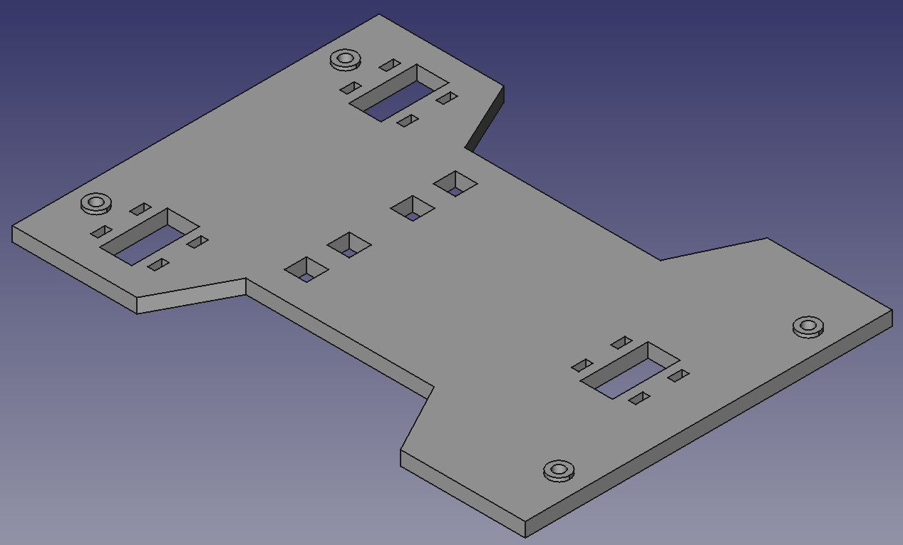
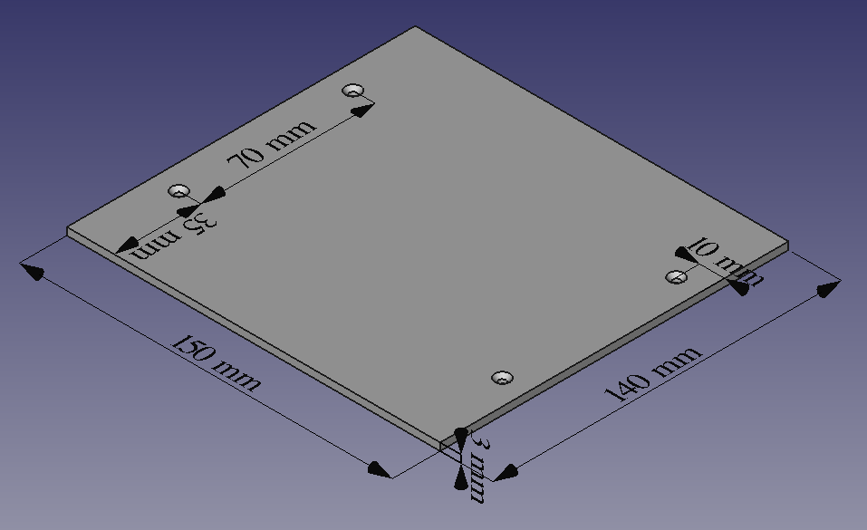

# Y-carriage with 4 points to hold the bed

## Files

  - [y-carriage-4points.stl](y-carriage-4points.stl) (STL printable)
  - [y-carriage-4points.fcstd](y-carriage-4points.fcstd) (FreeCAD source document)

## Bed measures

